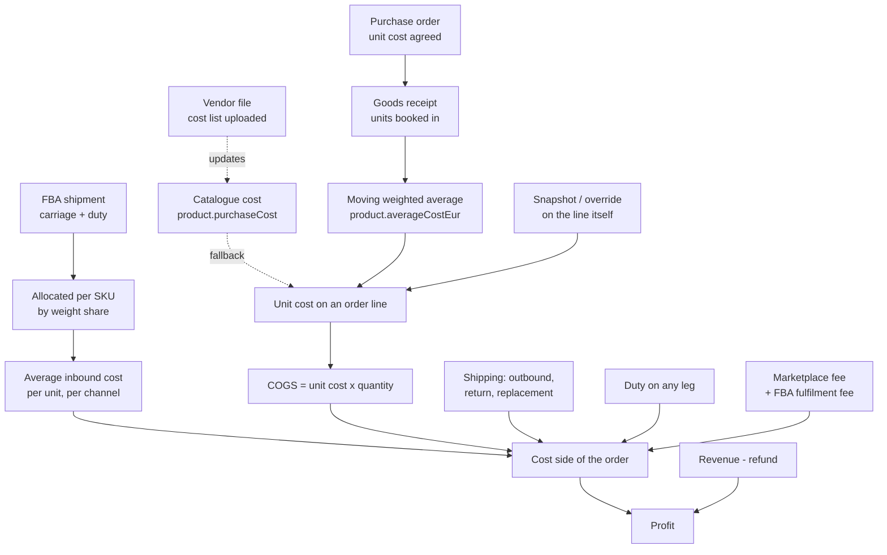

# How a SKU gets its cost

Almost every number that matters — margin, the repricing floor, profitability by channel —
is built on one figure: what a unit cost us. That figure is assembled from several places,
and this page follows it end to end.

It is worth reading once because the chain is long and each link is invisible from the next.
Three real costing bugs found in this platform were all the same mistake: a cost recorded
correctly at one end of the chain that never arrived at the other.

## The chain



## Where a unit cost comes from

An order line asks four questions in order and takes the first answer it gets. The order is
not arbitrary — it runs from the most specific to the most general.

| Source | Used when | Meaning |
|---|---|---|
| **Override** | Someone typed a cost on the line | This particular sale cost this much. Beats everything. |
| **Snapshot** | The line was frozen with a cost | What it cost *at the time*, kept so history does not move when today's average does. |
| **Average** | The product has a moving average above zero | The normal case: the running landed cost from receiving. |
| **Catalogue** | No average yet | The cost on the product card — a standing estimate until something is actually received. |

If none of the four answer, the unit cost is **zero**, and the order will report the whole
sale as margin. That is why the order screen warns when a line has no cost source.

> An average of exactly zero counts as *no average*, not as *free*. Receiving seeds the
> average from the receipt, so a purchase order booked with no cost would otherwise wipe out
> a perfectly good catalogue cost and silently report a 100% margin.

## How the average moves

Receiving maintains it. Each inbound movement recalculates:

```
new average = (quantity before x average before + quantity in x unit cost) / quantity after
```

Two behaviours worth knowing:

- **Selling does not move the average.** Stock leaves at the running average, so despatching
  units changes the quantity but not the cost per unit.
- **The first receipt sets it.** With no prior quantity or no prior average, the average simply
  becomes the receipt's unit cost.

It is stored to two decimal places, deliberately: quantity x average then reconciles by hand
against what is on screen.

## FBA is a second, parallel chain

An FBA order is not shipped by us, so its "shipping cost" is something else entirely: what it
cost to get the units *to Amazon*, plus what Amazon charges to fulfil them.

1. An **FBA shipment** records carriage and, since it crosses a border, **duty**.
2. Both are added together and **shared across the SKUs in the shipment by weight**.
3. That per-line figure becomes an **average inbound cost per unit** for that SKU on that channel.
4. An FBA order picks up that average, plus Amazon's **fulfilment fee**, as its shipping cost.

Duty is levied on customs value rather than weight, so sharing it by weight is a simplification —
the same one carriage already makes. It keeps one number per SKU rather than two that divide
differently.

> Until Amazon settles the fulfilment fee, roughly two weeks after the sale, the platform
> estimates it from that SKU's own recent average. The figure is marked as provisional wherever
> it is shown, and the real fee replaces it when it arrives.

## What the order finally subtracts

```
revenue  =  (net sales + shipping charged)  -  refund

cost     =  COGS                     (reversed if the goods never left, or came back resellable)
         +  marketplace sales fee
         +  outbound shipping        (actual when recorded, else the estimate)
         +  return shipping          we paid for
         +  replacement shipping     sending a second unit out
         +  duty                     on every leg, whichever direction
         +  FBA fulfilment fee       (FBA orders)

profit   =  revenue - cost
```

Every shipping leg counts, and this is the part most easily got wrong. An order that went out,
came back, and went out again has **three** carriage costs against one sale. Leaving any of them
out makes a loss-making order look profitable — which is exactly what happened before the
replacement leg was included.

## When the chain breaks

| Symptom | Usually means |
|---|---|
| Margin looks impossibly high | The line has no cost source — check the product has a cost or a receipt |
| FBA order shows no inbound cost | No confirmed FBA shipment covers that SKU on that channel |
| Profit disagrees with the shipping column | A leg is recorded but not counted, or counted twice |
| Average cost never moves | Receipts are being booked with no unit cost |

## Related

- [What can change a stock quantity](/help/processes/what-can-change-a-stock-quantity)
- [Money in a return](/help/processes/money-in-a-return)
