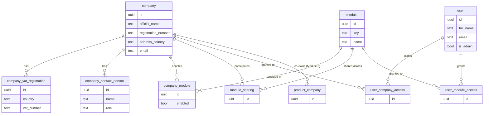

# maSquare Platform — Module 1: Foundation

**Status:** Draft for approval · **Scope:** Multi-company structure, users & permissions, multi-tenancy, sharing, and the shared-component contracts that every later module depends on.

This document is the project's founding reference. Modules 2 (Global Settings) and 3 (Products) build directly on the entities and contracts defined here.

---

## 1. Decisions carried into this module

| Topic | Decision |
| :---- | :---- |
| Hosting | Cloud-hosted web app, containerised, cloud-agnostic (provider chosen later). Apps Script is not used for this platform. |
| Stack | PostgreSQL · React + TypeScript front end · TypeScript (NestJS) core API, with Python workers reserved for future analytics/tax jobs. |
| Multi-tenancy | Single shared schema, row-scoped by company; shareable modules co-own records across companies. |
| Shared products | Co-owned — any company sharing the module can edit. No per-company catalogue overrides. |
| Currency | EUR-only for now. Money stored as `amount + currency_code` (default `EUR`) so multi-currency lands later without migration. |
| User access | Two independent grants per user: companies + modules. New users default to all-access; admin toggles off. |
| SKU model | One product = one master record. Main SKU plus free-form alias SKUs (optional label), all unique in one platform-wide namespace, all pointing to the same product. |
| Volumetric weight | (L × W × H, cm) ÷ 5000, expressed in grams. |

**One open interpretation to confirm:** access is modelled as *companies × modules* (a user who has Products and has Company A can use Products for Company A). It is **not** yet a per-(company, module) matrix. Confirm this is sufficient for now.

---

## 2. Architecture overview

A single deployment serves all companies. The back end is a TypeScript API over PostgreSQL; the front end is a React SPA. Product media lives in object storage (GCS/S3-compatible). A background job queue is provisioned in the foundation but only exercised from Module 4 onward (marketplace pulls, FX, analytics).

Three concerns are built **once** in the foundation and consumed by every module: the smart reference input, the bulk-import framework, and the modal shell (Section 7).

---

## 3. Multi-tenancy & sharing model

Every business record carries an owning scope:

- **Company-scoped** (default): the record belongs to exactly one company and is row-filtered by `company_id`.
- **Shared**: when the admin marks a module as shared between a set of companies, that module's records are co-owned by all participating companies. The Products module is the first shared module; products are linked to every participating company and any of them may edit.

Sharing is configured per module:

- `company_module` records, per company, which modules are enabled.
- `module_sharing` records, per shared module, which companies participate. All participants co-own that module's records.

For Products specifically, ownership is expressed through a `product_company` link (many-to-many), populated from the sharing set. (Product entities themselves are defined in Module 3; the link is named here so the sharing mechanism is complete.)

---

## 4. Foundation data model

Conventions (Section 8) — UUID keys, audit columns, soft-delete, money as amount+currency — apply to every table and are not repeated per field.

### 4.1 `company`

| Field | Type | Notes |
| :---- | :---- | :---- |
| official_name | text, required | Registered name |
| registration_number | text | |
| address_line1 / line2 | text | Structured address |
| address_city | text | |
| address_region | text | State/province/region |
| address_postal_code | text | |
| address_country | text | ISO 3166 country |
| email | text | Main company email |
| website | text | |
| phone_landline | text | |
| phone_mobile | text | |

### 4.2 `company_vat_registration` (1 company → many)

| Field | Type | Notes |
| :---- | :---- | :---- |
| company_id | fk | |
| country | text, required | Registration country |
| vat_number | text, required | e.g. `CY10156304C`, `IT00441109998` |

### 4.3 `company_contact_person` (1 company → many)

| Field | Type | Notes |
| :---- | :---- | :---- |
| company_id | fk | |
| name | text, required | |
| surname | text | |
| email | text | |
| phone | text | |
| role | text | |

### 4.4 `module` (seed catalogue)

| key | name | status |
| :---- | :---- | :---- |
| companies | Companies | Core (always on) |
| users | Users & Permissions | Core (admin) |
| global_settings | Global Settings | Module 2 |
| products | Products | Module 3 (shareable) |
| inventory | Inventory & Warehouses | Future |
| integrations | Marketplace Integrations | Future |
| tax_finance | Tax & Financial | Future |
| analytics | Analytics | Future |
| assets | Assets | Future |

### 4.5 `company_module`

| Field | Type | Notes |
| :---- | :---- | :---- |
| company_id | fk | |
| module_id | fk | |
| enabled | bool | Admin enables modules per company |

### 4.6 `module_sharing`

| Field | Type | Notes |
| :---- | :---- | :---- |
| module_id | fk | Module being shared |
| company_id | fk | Participating company (co-owns this module's records) |

### 4.7 `user`

| Field | Type | Notes |
| :---- | :---- | :---- |
| full_name | text, required | |
| email | text, required, unique | Login identity |
| password_hash | text | Hashed (argon2/bcrypt); never stored plain |
| status | enum | active / disabled |
| is_admin | bool | Admin can manage companies, users, sharing |

### 4.8 `user_company_access` & `user_module_access`

| Table | Fields | Meaning |
| :---- | :---- | :---- |
| user_company_access | user_id, company_id | Companies this user may access |
| user_module_access | user_id, module_id | Modules this user may use |

**Effective permission:** a user may use module *M* in the context of company *C* when *M* ∈ their module grants **and** *C* ∈ their company grants. Admins implicitly hold all grants.

---

## 5. Entity-relationship diagram

---

## 6. Shared-component contracts

These are platform-wide behaviours, built once.

### 6.1 Smart reference input

A typeahead control used on every reference field (vendor, brand, category, product type, attribute, etc.).

- As the user types, it suggests existing values pulled from the central store, drawing across modules.
- If the typed value does not exist, the control offers to create it — but only after an explicit **confirmation prompt**. On confirm, the value is committed and becomes immediately selectable everywhere.
- Backed by a generic reference-value lookup (Postgres full-text + trigram), so no per-field bespoke code.

### 6.2 Bulk-import framework

Every data-entry surface accepts manual entry **and** `.xls` / `.csv` upload.

- Upload → **column-mapping** step (file columns → target fields).
- **Validation** with a row-level error report.
- Unknown reference values are surfaced in a **review screen** that batches the same confirm-to-create step from 6.1.
- **Dry-run preview** of what will be created/updated before commit.

### 6.3 Modal shell

Reusable modal used by all create/edit flows.

- Centered; header (right) has a full-page expand toggle and a close control.
- Bottom-right drag handle resizes horizontally and vertically.
- Body organised in **tabs** by content grouping.
- Footer: primary CTA (e.g. *Create Product*, *Save*) + *Cancel*.
- Cancel/close after any change raises a prominent **unsaved-changes warning** before discarding.

---

## 7. Cross-cutting conventions

- **Primary keys:** UUID.
- **Audit columns:** `created_at`, `updated_at`, `created_by`, `updated_by` on every table.
- **Soft delete:** `deleted_at` (records are retired, not hard-deleted) to preserve referential history for shared/aliased data.
- **Money:** `amount` (numeric) + `currency_code` (ISO 4217), defaulting to `EUR`.
- **Country/VAT:** ISO 3166 country codes; VAT numbers free-text per registration.
- **Row scoping:** company-scoped tables filtered by `company_id`; shared modules resolved through their participation/junction tables.

---

## 8. Out of scope for Module 1

Defined later, but anticipated by this model: Global Settings reference data (Module 2); product entities, SKUs/aliases, attributes, media, categories (Module 3); inventory/warehouses, marketplace integrations, tax/financial, analytics, assets (future); multi-currency & FX, per-channel listing economics, predefined role templates, finer per-(company, module) permissions.
